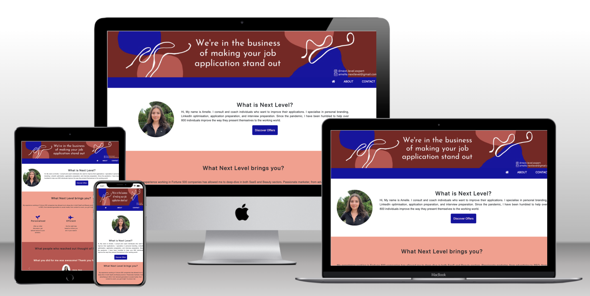
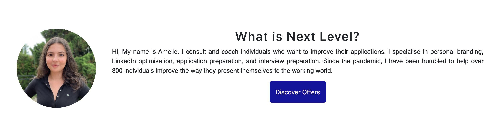
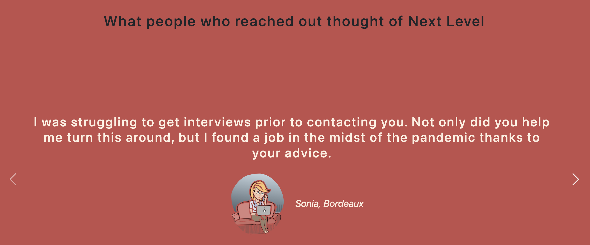
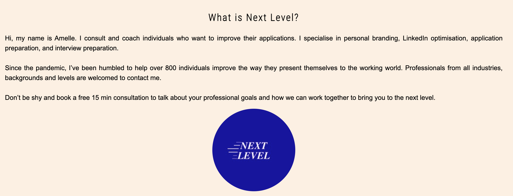
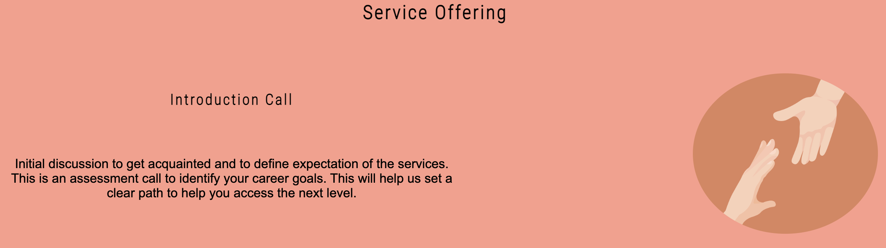
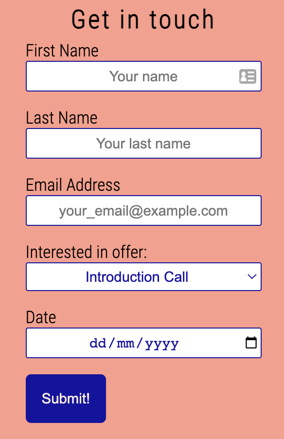
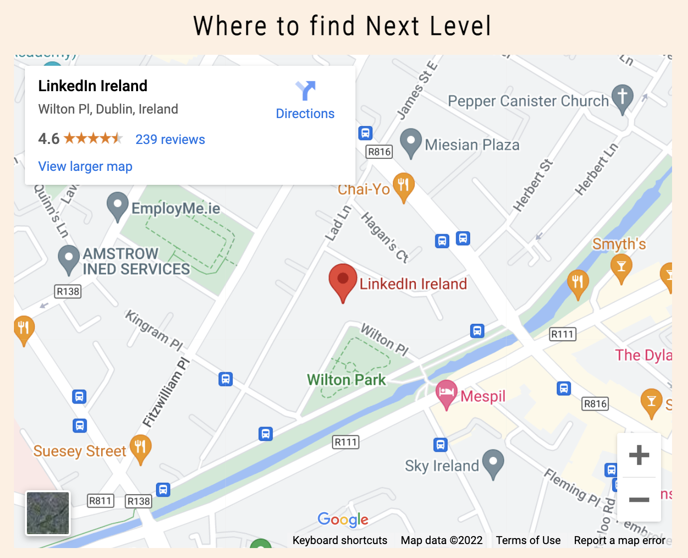

# project-portfolio-1-next-level

## Next Level Mock Up Website

Next Level Mock Up is a trial for the website for Next Level, an organisation helping people in career coaching. The purpose of this website is to explain what Next Level is, who the founder is, and the services Next Level provides for its customers. Users of this website will be to read more about feedback from some of the customers and will be able to get in touch through different channels. 

The live website can be found here: [Next Level Mock Up Website](https://nfepb.github.io/project-portfolio-1-next-level/index.html).



## Features

### Index Page

- **Banner**
  - Banner image that displays the colors used on the website and reflect the colors of the brand.
  - The slogan is watermarked in the image


- **Navigation**
  - The navigation bar give the user clear view over what is available on this website. 
  - The user can easily access the Home, the About and the Contact pages from any of the pages of the website. 
  - An icon from [Font Awesome](https://fontawesome.com/) is used to display the 'Home' option
  - On hover, the elements of the menu change color
  - When the device is small, the menu style change from a row to a column display to make accessibility easier.
 


- **Presentation Section**
  - A picture of the founder of the organisation.
  - The presentation section provides a brief description of the founder of the organisation and her background. It gives some information about Next Level and what the organisation has achieved this far.
  - The user understand what this website is about.
  - A call to action button ```submit``` that will re-direct the user to the contact page.



- **Specificities Section**
  - Description of some knowledge and experience Next Level can bring to its customers.
  - The icons used are illustrative and there to bring more visual effect reinforcing the description for each specifity.
  - After reading this section, the user understand the added value of the services provided by Next Level and how it can help them.


- **Testimonials Section**
  - A Title introducing the section.
  - A carousel using the [Bootstrap](https://getbootstrap.com/) technology displays testimonials of some customers that shared a feedback after using the Next Level services. 
  - The user can scroll through the reviews by clicking on the arrows or using the arrows on their keyboard.
  - With each testimonial, the name and the city of the customer is displayed, alongside their social media profile picture.
  - The purpose of this section is to reassure the user of the quality of services provided by Next Level.



- **Footer**
  - The footer is at the bottom of every page to help the user to find other ways to connect with Next Level.
  - The links to the social media pages (Instagram & Linkedin) in the form of icons
  - The links open in a new page


### About page

- **Detailed Presentation Section**
  - This section is for the user who wishes to know more about Next Level. They can find more detailed information (the values) alongside the logo of the organisation.



- **Services Offering Section**
  - This section offers a brief description of the different services that Next Level can offer to its customers. 
  - An image is displayed with each description.



### Contact page

- **Contact Section**
  - A simple form is displayed to collect information from the user. The form allows the user to provide their contact details and to select which offering they are interested in.
  - Placeholder text is displayed to help guide the user on the format of the data for input
  - The box for each input is displayed based on the hovered/selected box.
  - The first name, last name, and email fields are mandatory in order to be able to submit the form. 
  - The type of fields defined in the HTML file allow an initial data validation.
  - The background color disapper when the screen is small.



- **Map Section**
  - An iFrame displaying the (fictitious) location of the organisation allows the user to find the location of the organisation.



## Testing
- This page works in Chrome and Firefox (mobile and desktop versions).
- This project is responsive on all screen sizes using dev tools.
- The text of all sections is readable and easy to understand.
- The form works, requires entries in the first 3 fields and the submit button works.

### Validator Testing

- **HTML**
  - No errors were found when passing throught official [W3C Validator](https://validator.w3.org/#validate_by_input).

- **CSS**
  - No errors were found when passing throught official [W3C Validator](https://jigsaw.w3.org/css-validator/validator).

- **Accessibility**
  - Mobile

[Lighthouse screenshot mobile]

  - Desktop

[Lighthouse screenshot desktop]

  - Accessibility
    - I confirmed that the colours have enough contrast and fonts chosen are easy to read, and all links, icons and images have descriptive text for screen readers running it through Lighthouse in Chrome DevTools.

## Bugs & Errors

### Solved

- After deploying the website through Github pages, the rendering was not the same. I had to fix some of the code.
- The padding on the carousel element on the home page was not taking the entire width of the page, leaving white space. 
- When first passing through the HTML validator, an error was identified where an anchor ```<a>``` can not be used to wrap around an ```<input>``` button.
  - This was fixed by changing the anchor to a ```<form>```
- There were some closing tags that were not in order. I re-arranged them to pass the validator.
- The CSS Validator did not recognise ```flex-wrap: row wrap``` and ```column wrap``` 
  - I re-defined the ```flex-wrap``` and added the ```flex-direction```
- After initially going through the Lighthouse testing, the images were not in the Next Gen format.
  - Modified the format of the images
- Resources were blocking the first paint of the home page.

### To be solved

- CSS does not get applied on the first section of the Index page
- Image rendering
- Content alignment in footer
- Padding and margin on specificities of about page

## Technology used

- [Font Awesome](https://fontawesome.com/) for the icons throughout the website
- [Bootstrap](https://getbootstrap.com/docs/5.2/components/carousel/) for the carousel.
- [Google Maps](https://developers.google.com/maps/documentation/javascript/adding-a-google-map) for the map location on the contact page
- [Pixabay](https://pixabay.com/) for the images used for the testimony
- [Technisi](http://techsini.com/) for the website rendering image
- [W3schools](https://www.w3schools.com/) for the support of documentation.

## Deployment

- The project was deployed through **GitHub pages**, following the steps:
- Go into the chosen repository
- Navigate to the **Settings** tab in the GitHub rep
- Select the **Pages** section in the sub-menu
- Choose Master Branch from the source section
- Click on **Deploy site**. After a few seconds, the URL of the deployed site will be accessible.

The live website can be found at the [following location](https://nfepb.github.io/Portfolio-Project-1/)

## Credits

- My mentor, Ronan for his support and guidance through the project.
- My family for their support.
- My Mac, for not giving up on me in this heat.
